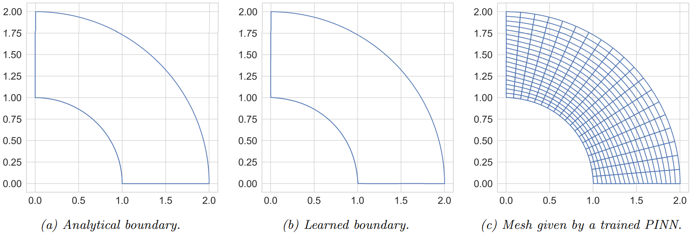

# PINNs_for_harmonic_maps

**Physics-Informed Neural Networks for solving non-divergence form PDE and harmonic map equations**  
Semester project, Spring 2025, EPFL

---

## Table of Contents

1. [Motivation](#motivation)
2. [Installation](#installation)
3. [Usage](#usage)
4. [Report](#report)
5. [Folder structure](#folder-structure)
6. [License](#license)
7. [Author](#author)

---

## Motivation

Harmonic maps are fundamental tools in geometry, physics, and PDE-constrained optimization, used to construct smooth mappings between domains. However, solving harmonic map equations is challenging due to their nonlinearity and the complexity of enforcing boundary conditions.

This project explores the use of Physics-Informed Neural Networks (PINNs) as a flexible, mesh-free alternative to traditional solvers. By embedding the PDE and boundary conditions directly into the loss function, PINNs offer a powerful framework for approximating solutions to harmonic map problems, even in cases where analytical solutions are unavailable or classical methods are difficult to apply.

---

## Installation

Clone the repository and install dependencies:

```bash
>>> git clone https://github.com/MattiaBarbiere/PINNs_for_harmonic_maps.git
>>> cd PINNs_for_harmonic_maps
>>> pip install -e .
```
The scirpt above should install all the requirements, if this is not the case run
```bash
>>> pip install -r requirements.txt
```

Ensure you have Python 3.10+ and a virtual environment activated.

---

## Usage

### Running experiments
The code and results of the experiment are avaliable in the subdirectory inside `simulation_studies/`. Each experiment folder has an `ouputs/` subfolder with all the experimental data (i.e. trained model, loss and error values etc.) and the `config/` subfolder contains the configuration files for each experiment. Please read the additional [README.md](./simulation_studies/README.md) before running the scripts.

### Plotting results
The `hmpinn/plotting/` files are very useful in plotting the results directly from the path of the data. A lot of results (both the good and bad ones) are avaliable as notebooks in the `scripts/` subfolder. 

---

## Report

For the full report of the project, including theoretical background and experimental analysis, visit [Mattia_Barbiere_report.pdf](./Mattia_Barbiere_report.pdf).

### Example


---

## Folder Structure

Below is a summarised folder structure for the `hmpinn` package:

```
hmpinn/
│
├── __init__.py                # Package initialization
├── constants.py               # Global constants and default configs
├── loss_function.py           # PINN loss function class
├── embedding.py               # Embedding layer class
│
├── models/                    # PINN model architectures
│
├── PDEs/                      # PDE classes
│   ├── __init__.py
│   ├── PDE_factory.py         # PDE class construction
│   ├── harmonic_maps/         # Harmonic map classes
│   ├── div_form_PDEs/         # Divergence form PDE classes
│   ├── non_div_form_PDEs/     # Non-divergence form PDE classes
│   └── parent classes ...     # Parent classes to construct PDE classes
|
├── samplers/                  # Domain/boundary point samplers
│
├── utils/                     # General utilities and helpers
│   ├── __init__.py
│   ├── utils.py               # Core utility functions
│   ├── yaml_utils.py          # YAML config loading/parsing
│   └── ml_utils.py            # ML training helpers
│
└── plotting/                  # Plotting and visualization
```

---

## License

This project is licensed under the **MIT License**. See the [LICENSE](LICENSE) file for more details.

---

## Author

Developed by **Mattia Barbiere** as part of the spring 2025 semester project at EPFL.  
GitHub: [@MattiaBarbiere](https://github.com/MattiaBarbiere)

---
